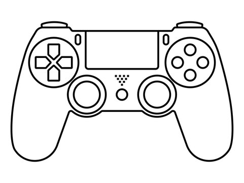

# DS4Arduino

[](https://www.ardu-badge.com/DS4Arduino)
[](https://github.com/vaibhav-rm/DS4Arduino/releases)
[](https://github.com/vaibhav-rm/DS4Arduino/commits)
[](LICENSE)
[](https://www.espressif.com/en/products/socs/esp32)

Native DualShock 4 Bluetooth Classic HID host for the **original ESP32**, usable from the normal Arduino IDE / Arduino-ESP32 environment.

<picture>
  <source media="(prefers-color-scheme: dark)" srcset="assets/pad-dark.png">
  
</picture>

```
DualShock 4 --(Bluetooth Classic)--> ESP32 --> DS4Arduino --> Arduino sketch
```

No PS4 console, USB Bluetooth dongle, Bluepad32 runtime, SixaxisPairTool, or Windows required for normal use.

## Status

**v0.1.0 — input path validated on hardware (2026-10-03).**

Real DualShock 4 (CUH-ZCT1x) + DOIT DEVKIT V1,
Arduino-ESP32 3.3.11: SHARE+PS pairing, SSP bond, L2CAP control+interrupt,
full input report `0x11` (78 B) with live stick/trigger values. Reconnects
without re-pairing (bond in NVS).

| Phase | Goal | State |
|---|---|---|
| 1 | Library skeleton, compile test | Done |
| 2 | Bluetooth discovery (`Scanning... / DS4 found`) | Done on hardware (Classic inquiry + name/CoD match) |
| 3 | Connection (control + interrupt channels) | Done on hardware (raw L2CAP PSM `0x11`/`0x13`, config + SSP bond) |
| 4 | Raw HID reports (`REPORT ID: 0x11`) | Done on hardware (78 B full reports at stick rate) |
| 5 | Parser: sticks/triggers | Done, live values verified |
| 6 | Buttons + D-pad | Parsed; verify with `ControllerTest` + web tester |
| 7 | Motion sensors | Parsed raw int16; calibration via feature `0x05` pending |
| 8 | Output (LED/rumble) | Transport send works (LED set on connect); rumble to verify |
| 9 | Reconnect | Done on hardware (bond in NVS, auto-reconnect, no re-pairing) |
| 10 | Examples | `BasicConnect`, `ControllerTest`, `RCCar` present |

> First real milestone reached: original ESP32 + real DualShock 4 → Bluetooth connection → report `0x11` → printed stick values. See `docs/RESEARCH.md` §12.

## Supported hardware

- ESP32-WROOM-32 / original ESP32 (Bluetooth Classic BR/EDR) — target.
- DOIT ESP32 DEVKIT V1 — reference board.
- Sony DualShock 4 CUH-ZCT1x / CUH-ZCT2x (USB VID:PID `054c:05c4`, `054c:09cc`).
- **Not supported:** ESP32-S3/C3/C6 (no Bluetooth Classic) — `begin()` fails loudly with `Not supported on this hardware/core` instead of silently misbehaving.

Arduino-ESP32 core: targets 2.x (ESP-IDF 4.4) and 3.x (ESP-IDF 5.x) via the ESP-IDF HID-host API. If your core moves/renames the HID-host header, please file an issue with the core version — do not downgrade blindly.

## Installation

Via Library Manager (recommended): Arduino IDE → Sketch → Include
Library → Manage Libraries → search **DS4Arduino** → Install.

No Library Manager entry on your setup? Fall back to ZIP: Sketch →
Include Library → Add `.ZIP Library` (or clone into
`Documents/Arduino/libraries/DS4Arduino`).

Then:

1. Tools → Board → `DOIT ESP32 DEVKIT V1` (or your original-ESP32 board).
2. Open File → Examples → DS4Arduino → `BasicConnect`, flash.

## Pairing (preferred flow)

1. Flash the sketch, power the ESP32, open Serial Monitor at 115200.
2. Make sure the controller's light bar is **off** (hold PS until it turns off, unplug USB).
3. Hold **SHARE + PS** until the light bar flashes white (pairing/inquiry mode).
4. Wait for `DS4 found: XX:XX:XX:XX:XX:XX` → `DS4 connected`.
5. Move sticks; `BasicConnect` prints `LX=... LY=...`.

Background: the DS4 historically stores its master's Bluetooth address (which is why old libs needed SixaxisPairTool to write the ESP32 MAC into the controller). Modern SSP "just works" pairing in SHARE+PS mode avoids that. This library uses the ESP-IDF HID-host + SSP bonding path (link key in NVS). Legacy MAC-write is documented in `docs/RESEARCH.md` as a fallback only.

## Minimal sketch

```cpp
#include <DS4Arduino.h>

DS4Controller ds4;

void setup() {
    Serial.begin(115200);
    ds4.begin();
}

void loop() {
    ds4.update();
    if (!ds4.connected()) return;

    Serial.printf("LX=%d LY=%d RX=%d RY=%d\n",
        ds4.leftStickX(), ds4.leftStickY(),
        ds4.rightStickX(), ds4.rightStickY());
}
```

## API reference

| Call | Meaning |
|---|---|
| `begin()` / `end()` | Start/stop Bluetooth + discovery |
| `update()` | Drain BT queue, parse newest state (call each `loop()`) |
| `connected()` | True once HID interrupt + control channels are up |
| `lastError()` / `lastErrorText()` | Sticky error code/string |
| `leftStickX/Y()`, `rightStickX/Y()` | 0..255, centre 128 |
| `l2()`, `r2()` | Analog triggers 0..255 |
| `cross/circle/square/triangle()` | Face buttons |
| `l1/r1/l3/r3()` | Shoulders + stick clicks |
| `share/options/ps/touchpad()` | System buttons |
| `dpad()` + `dpadUp/Down/Left/Right()` | Hat `0..7`, `8` = released |
| `gyroX/Y/Z()`, `accelX/Y/Z()` | Raw int16 (calibration via feature `0x05` is future work) |
| `touch0/1Active/X/Y()` | Touchpad contacts (0..1920 / 0..942) |
| `batteryLevel()` / `charging()` | 0..10 + charging flag |
| `setLED(r,g,b)` / `setRumble(small,large)` | Phase 8: builders ready, transport send pending HW test |
| `lastReportId/lastReportLen()` | Phase-4 diagnostics |

Errors are never silent: `Bluetooth initialization failed`, `No DS4 found`, `Pairing failed`, `HID connection failed`, `Controller disconnected`, `Invalid HID report`, `Unsupported report ID` are all surfaced via `lastErrorText()` and Serial banners.

## Examples

- `examples/BasicConnect` — connection + raw report + sticks/triggers/buttons/battery.
- `examples/ControllerTest` — press-every-button check with edge prints and
  light-bar stepping, plus 20 Hz `$DS4` machine lines for the web tester.
- `examples/RCCar` — TB6612FNG car: left-stick Y = throttle, right-stick X = steering. Motor code lives **only** in the example, never in the core library.

## Docs site + live web tester

`docs/` is a static site ready for GitHub Pages (Settings → Pages → Deploy
from branch → `/docs`): landing page, pairing guide, API reference, and
`live.html` — a WebSerial tester that opens the ESP32 serial port
(Chrome/Edge) and visualizes sticks, buttons, triggers, IMU, touchpad and
battery live from `ControllerTest` output.

TB6612FNG pins: `PWMA=5, AIN1=18, AIN2=19, PWMB=23, BIN1=21, BIN2=22, STBY=17`.

## Troubleshooting

| Symptom | Likely cause / fix |
|---|---|
| `Not supported on this hardware/core` | S3/C3/C6 board selected, or BT disabled — use original ESP32 |
| Never finds DS4 | Controller not in SHARE+PS flashing-white mode; move closer; check USB cable unplugged |
| Connects then drops | Weak power (use stable 5V), WiFi/BT coexistence load, or link-key not stored (erase NVS once) |
| Only small `0x01` reports, no gyro/touch | Full `0x11` mode not enabled yet — host must send an output report first (Phase 8 follow-up) |
| Sticks work but battery always 0 | You are seeing minimal-mode reports; same cause as above |
| Old controller bound to a PS4 | Reset with paperclip near L2, then SHARE+PS; legacy SixaxisPairTool MAC-write is a last resort |

## Layout

```
src/            DS4Arduino.h (umbrella), DS4Controller, DS4Bluetooth, DS4HID, DS4Parser, DS4Types
examples/       BasicConnect, RCCar
docs/           RESEARCH.md (protocol + compatibility analysis)
```

Performance notes: fixed-size structs, static buffers, FreeRTOS queue (depth 6) from BT callbacks to `loop()`, no `String` logging in callbacks, each report parsed once in `update()`.

## License

MIT — see `LICENSE`.
